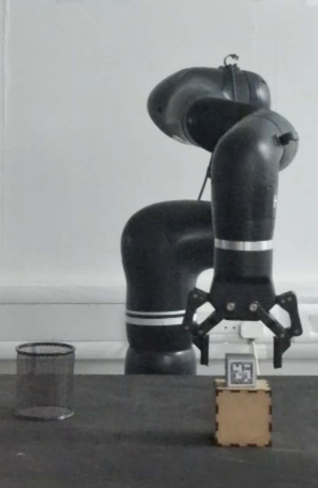
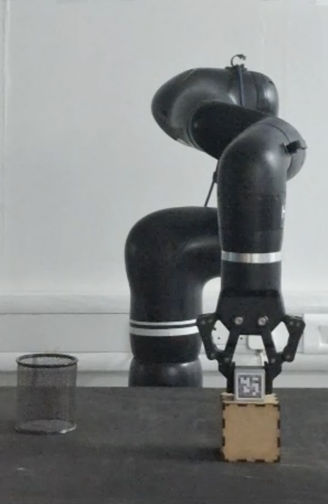
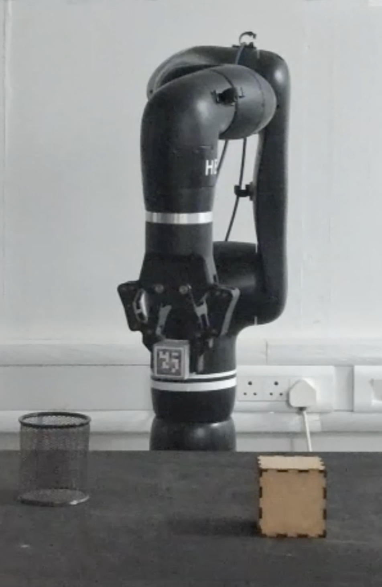
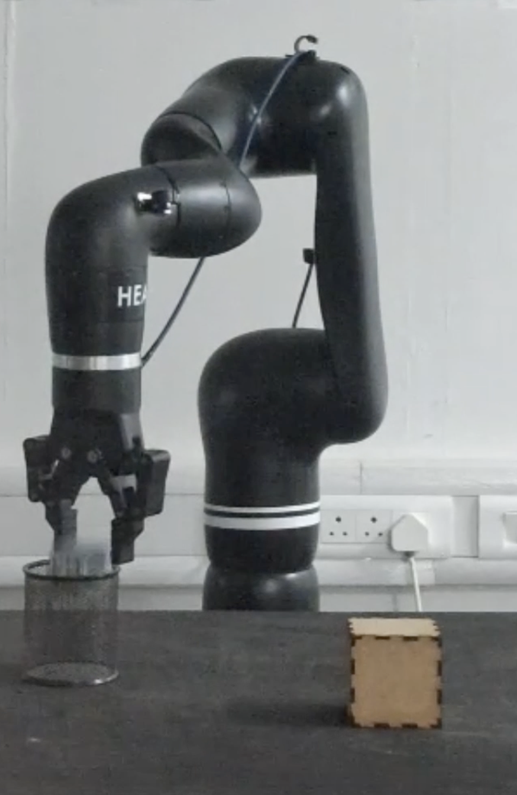
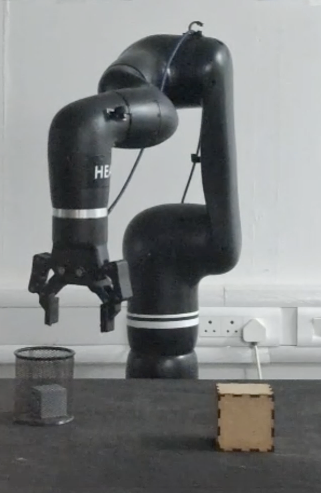

# Addverb Heal Teleoperation

## Overview

This Git repository contains two core Python packages for teleoperating the Addverb Heal dual-arm robot:

- **`vision_heal_teleop`** – Enables **vision-based Cartesian-space teleoperation** using an Intel RealSense camera and ArUco marker tracking.
- **`keyboard_teleop`** – Provides **manual teleoperation via keyboard input**, allowing the user to control the robot’s motion by issuing velocity commands directly from the keyboard. This mode is useful for testing, calibration, and simple manual tasks without requiring a visual interface.

---

The `vision_teleop` package enables Cartesian-space teleoperation of the Addverb Heal dual-arm robot using vision-based input. It uses an Intel RealSense camera to detect an ArUco marker and translates its position into real-time joint velocity commands for the robot, allowing smooth and responsive motion in 3D space.

Inverse kinematics (IK) is computed using the **Mink** library, which optimizes motion in real-time based on task-space and posture constraints. **MediaPipe** is optionally used to process hand or gesture inputs for intuitive human-robot interaction.

The system operates in ROS and publishes velocity commands to a joint velocity controller. This setup allows precise control of the robot's end-effector based on external visual cues.

This teleoperation framework can also perform advanced manipulation tasks such as pick-and-place, making it ideal for remote manipulation.

<p align="center">
  
  
  
  
  
</p>

<p align="center">
  <a href="https://youtu.be/wl9rbc5eun8" target="_blank">
    ▶ Watch the demo video on YouTube
  </a>
</p>


## Installation & Setup

### 1. Clone the Repository

```bash
git clone https://github.com/IITGN-Robotics/ME299-Teleoperation_on_FR3_and_Heal.git
cd ME299-Teleoperation_on_FR3_and_Heal
```

### 2. Install Python Dependencies

Make sure you're using **Python 3.8+**. Then install the required libraries using:

```bash
pip install numpy matplotlib scipy rospy
pip install mink
```
[🔗 Mink GitHub Repository](https://github.com/kevinzakka/mink)

#### Additional ROS Dependencies

Install required ROS message packages:

```bash
sudo apt-get install ros-noetic-geometry-msgs ros-noetic-sensor-msgs ros-noetic-std-msgs
```

---

### 3. Set Up Intel RealSense Camera

Follow the official [Intel RealSense Ubuntu Setup Guide](https://dev.intelrealsense.com/docs/compiling-librealsense-for-linux-ubuntu-guide) to install and configure the RealSense SDK.  
Ensure the camera is connected and publishing ArUco marker positions to the `/aruco_position` topic.

---

### 4. Set Up MuJoCo

Install MuJoCo and its Python bindings using the official guide:  
🔗 [MuJoCo Python Installation](https://mujoco.readthedocs.io/en/stable/python.html)


Here’s the section for **Running the Robot** and **Running the Scripts** in your README:

---

### 5. Running the Robot and Scripts

Follow these steps to start the robot and run the teleoperation scripts:

#### Step 1: Start the Robot and Controller
1. **Power on the robot and its controller**.

2. **Connect to the robot's controller**:
   Use SSH to connect to the robot’s controller from your local PC:

   ```bash
   ssh cobot@192.168.1.25
   ```

   Enter the password when prompted. This establishes a connection with the robot's controller.

3. **Navigate to the controller’s execution directory**:

   ```bash
   cd tests/build/
   ```

   This will take you to the required directory to run the robot's server.

4. **Start the Gripper**:

   To start the **gripper** and initiate communication with the hardware, use the following command:

   ```bash
   sudo ./gripper_test
   ```

    Once it’s running, the gripper should respond to commands and be ready for use in the teleoperation setup. Keep running `/gripper_test` till the gripper on the heal robot opens and closes. Once done press `ctrl+c`.

5. **Start the Heal server**:

   ```bash
   sudo ./heal_server
   ```

   This launches the server that manages the robot's hardware and communication. Do not close this terminal.


6. **Home the robot**:
   To bring the robot to its home position, run the following command:

   ```bash
   sudo ./base_rigid
   ```

   Make sure to run this command before shutting down the robot to ensure it homes correctly. Once done press `ctrl+c`.

#### Step 2: Launch the Robot Controller
1. **Open a new terminal on your PC** and navigate to the directory where the controller is stored:

   ```bash
   cd Debojit_WS/Addverb_Heal_and_Syncro_Hardware
   ```

2. **Source the workspace** to set up the environment variables:

   ```bash
   source devel/setup.bash
   ```

3. **Launch the controller using ROS**:

   ```bash
   roslaunch addverb_cobot_control bringup.launch
   ```
   If you get a message `robot has started` that means you you may go ahead and launch the scripts.

4. **Check the control mode**:
   Open the configuration file `addverb_cobot_control/config/default_control.yaml` to ensure the correct control mode is set:

   Ensure that the following line is set to **velocity**:

   ```yaml
   ros_control_mode: velocity
   ```

   If it's set to **effort**, update it to **velocity** to prevent errors.

####  Step 3: Running the Vision-based Teleoperation Scripts

This repository provides Python scripts for **vision-based teleoperation** of the **Heal robot**, using MuJoCo and ROS integration in the `vision_teleop` package:

- **`vision_data_sub.py`**: Controls the **real robot** by mirroring the motion of the MuJoCo-simulated robot, which follows a moving target in the simulated environment.
- **`vision_data_pub.py`**: Tracks the ArUco marker using vision and **updates the target position** in the MuJoCo simulation. It also controls the **gripper** (open/close) and **detects the hand joint position** using MediaPipe.


1. **Navigate to your ROS workspace**:

   ```bash
   cd ~/ME299-PC/src
   ```

2. **Source the workspace**:

   ```bash
   source ~/ME299-PC/devel/setup.bash
   ```

3. **Make all scripts executable** (if not already):

   ```bash
   chmod +x vision_data_sub.py
   chmod +x vision_data_pub.py
   ```

4. **Run the scripts (in separate terminals)**:

   **Terminal 1** – Run ArUco marker tracking and hand gesture:

   ```bash
   source Debojit_WS/Addverb_Heal_and_Syncro_Hardware/devel/setup.bash
   ```

   ```bash
   python3 vision_data_pub.py
   ```

   **Terminal 2** – Run the main real robot teleoperation script:
   ```bash
   python3 vision_data_sub.py
   ```


####  Step 4: Running the Keyboad-based Teleoperation Scripts
This repository contains Python scripts to teleoperate the **Heal Robot** in two modes:  
1. **Joint Space Teleoperation** using `joint_command.py`  
2. **Cartesian Space Teleoperation** using `cartesian_teleop.py`  

---

**1. Run Joint Space Teleoperation (`joint_command.py`)**  

To control the robot directly in **joint space**, follow these steps:  

**Step 1:** Navigate to the workspace directory:  
```bash
cd ~/ME299-PC/src
```  

**Step 2:** Source your workspace:  
```bash
source devel/setup.bash
```  

**Step 3:** Run the joint space teleoperation script:  
```bash
rosrun heal_teleop joint_command.py
```  

---

**2. Run Cartesian Space Teleoperation (`cartesian_teleop.py`)**  

To control the robot in **Cartesian space (X, Y, Z)**, follow these steps:  

**Step 1:** Navigate to the workspace directory:  
```bash
cd ~/ME299-PC/src
```  

**Step 2:** Source your workspace:  
```bash
source devel/setup.bash
```  

**Step 3:** Run the Cartesian space teleoperation script:  
```bash
rosrun heal_teleop cartesian_teleop.py
```  

## Flowchart of the Working of the Vision-Based Teleoperation


    

## Additional Notes for Seamless Integration

---

###  Vision-Based Teleoperation

This mode allows you to control the robot’s end-effector in **Cartesian space** using **ArUco marker tracking** and **MediaPipe-based gesture control**.

####  ArUco Marker Setup and Movement

1. **Print the ArUco Marker**  
   - You can generate and print a 6x6 ArUco marker by referring to the MoveIt tutorial:  
      [Hand-Eye Calibration Marker Guide](https://github.com/moveit/moveit_tutorials/blob/master/doc/hand_eye_calibration/hand_eye_calibration_tutorial.rst)

2. **Start the ArUco Node**  
   - Run the ArUco publishing script (e.g., `vision_data_pub.py`).  
   - A camera window will open showing the live video feed.  
   - Hold the ArUco marker steadily in view.

3. **Initialize the Marker Frame and gripper with hand gestures**  
   - **Press `C`** to **set the current marker position as the origin** (0, 0, 0) in the camera frame.  
   - Teleoperation begins relative to this reference point.  
   - You may need to press `C` **multiple times** until the robot begins responding — this confirms a stable frame has been established.
   - The gripper interprets gestures from **thumb and index finger** positioning (as detected by MediaPipe) to open or close the gripper.
   - The hand gestures to open and close the gripper are shown in the photoes below
<table>
  <tr>
    <td align="center">
      <strong>Opening Gripper</strong><br>
      
    </td>
    <td align="center">
      <strong>Closing Gripper</strong><br>
      
    </td>
  </tr>
</table>


4. **Control Tips**  
   - Move the marker **slowly and smoothly**.  
   - Sudden movements may trigger the robot’s **safety constraints**, causing it to stop.   

5. **To Stop the Camera Node**
    - Press `Q` in the terminal running the ArUco script.

### Keyboard-Based Teleoperation

This mode enables **manual joint-space control** of the robot using keyboard inputs.

1. **Run the Keyboard Teleop Script**  
   - Launch the script (e.g., `keyboard_teleop.py`) in your terminal.

2. **Use the Following Keybindings for Joint Control**:

| Key | Joint Action                     | Direction        |
|-----|----------------------------------|------------------|
| `q` | Move Joint 1                     | Clockwise   |
| `a` | Move Joint 1                     | Counterclockwise  |
| `w` | Move Joint 2                     | Clockwise  |
| `s` | Move Joint 2                     | Counterclockwise |
| `e` | Move Joint 3                     | Clockwise   |
| `d` | Move Joint 3                     | Counterclockwise |
| `r` | Move Joint 4                     | Clockwise        |
| `f` | Move Joint 4                     | Counterclockwise |
| `t` | Move Joint 5                     | Clockwise        |
| `g` | Move Joint 5                     | Counterclockwise |
| `y` | Move Joint 6                     | Clockwise        |
| `h` | Move Joint 6                     | Counterclockwise |

### Cartesian-Space Teleoperation

This mode lets you control the **robot's end-effector directly in task space (X, Y, Z + orientation)** using **keyboard inputs**.

##### Key Mappings and Cartesian Motions

| Key | Axis / Rotation                 | Direction             |
|-----|----------------------------------|----------|
| `q` | +X                     |Move end-effector left |
| `a` | -X                     |Move end-effector right |
| `w` | +Y                     | Move end-effector ahead |
| `s` | -Y                     |Move end-effector backwards |
| `e` | +Z                     | Move end-effector upwards |
| `d` | -Z                     |Move end-effector downwards |
| `r` | +roll            |         Rotate end-effector clockwise (X-axis) |
| `f` | -roll             |        Rotate end-effector counterclockwise (X-axis) |
| `t` | +pitch              |       Rotate end-effector clockwise (Y-axis) |
| `g` | -pitch               |      Rotate end-effector counterclockwise (Y-axis) |
| `y` | +yaw                |     Rotate end-effector clockwise (Z-axis) |
| `h` | -yaw                 |    Rotate end-effector counterclockwise (Z-axis) |

These controls send **Cartesian velocity commands** to the robot using its inverse kinematics solver (`Mink`), enabling smooth, intuitive motion.

---

####  Safety Shutdown Recovery

If the robot stops due to safety constraints (like collisions or jerky inputs):

1. **Reset the Base Controller**:
   ```bash
   sudo ./base_rigid_unsafe
   ```
2. **Restart the Gripper Server (If Required)**  
If the robot controller fails to start, you may need to manually restart the gripper server using the following command:  
```bash
sudo ./Gripper_test
```
